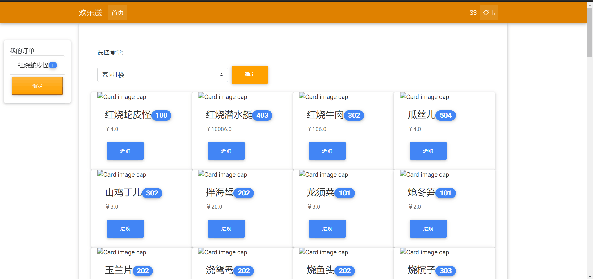
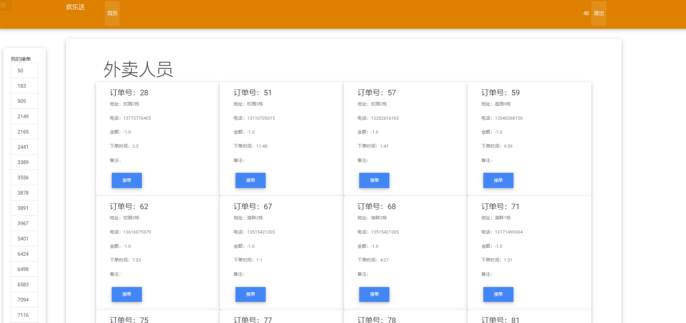
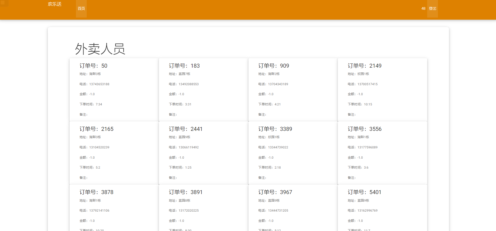
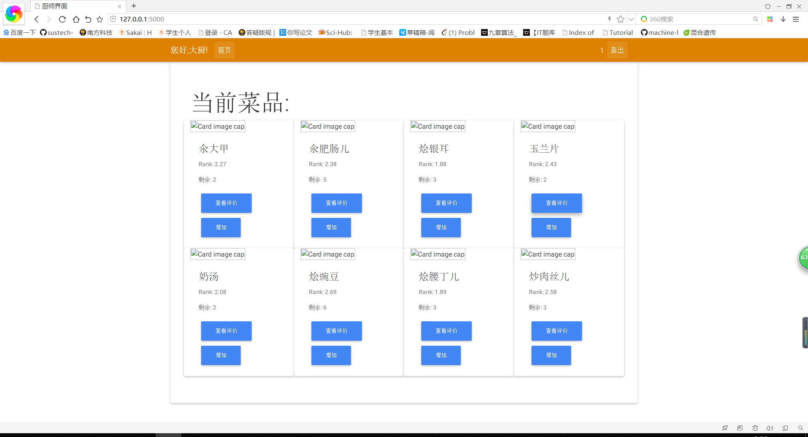

# 数据库系统原理 Project 期末报告

##### 项目名称 

**2019  欢乐送网上订餐平台**


##### 组员信息

11610101 韦青茂

11611526 陈胤淇

11612814 卢致睿

11610326 孙耀威


### 系统需求分析和定义

#### 需求背景

* 南方科技大学管理制度较为严厉，许多外卖无法送进校园
* 食堂地点偏僻
* 身体不适的同学因为没有电梯无法下楼
* 食堂饭菜较有安全保障

#### 解决方案

* 与食堂合作共同启用网上订餐平台进行送餐到床服务


### 数据需求分析和定义

#### 食客

* **信息管理**

  * 注册成为食客

  * 设置自身收货地址

    > 该需求需要使用address表，根据用户ID即UID更新地址信息

  * 设置自身联系方式

    > 以上需求需要列表有user 和 address两个列表，以外键相连，关键字为User_ID，每一个注册用户有一个独立的UID，UID是用户在数据库中的身份标识

  * 设置自身身份

    > 该需求只需要user表，作为一个键值存在。但是决定了用户的权限，以及订餐范围

  

* **订单管理**

  * 查看不同食堂有什么菜品

    > 通过食堂的HALL_ID与chef表、dish表、chef_to_dish表连接，获取所对应食堂的所有菜品

  - 查看菜品的价格
  
    > 以上需求需要dish, chef_to_dish 两个表单，其中，dish表单储存了菜品的信息，另一个表单决定了剩余菜量
  
  - 下单
  
    > 根据传入的HALL_ID与DISH_ID将chef_to_dish表中对应的REMAIN减去相应的数量
    >
    > 给order表新增订单的相关信息并生成ORDER_ID
  
  * 实时监控订单的状况
  
    > 通过order表的ORDER_ID,查询所对应的ORDER_STATE
  
  * 修改订单的状态
  
    > 以上需求需要 order 表单，order表单中将会存放订单的详情，订单的状态（NC：快递员尚未接单 AC：快递员已接单 ED：订单已完成）
  
  * 对订单中的菜品进行评价
  
    > 通过传入的菜品ID即DISH_ID及相应评论，将评论加入dish_comment表
  
  * 对订单的派送员进行评价
  
    > 以上需求需要 order表单和delivery_comment、dish_comment三个表单，其中，order表单存放订单的详情和菜品、派送员的对应信息，两个comment分别存放用户对菜品和派送员的评价，用来处理后续的打分工作

* **主要界面**




#### 送餐员

* **信息管理**

  * 注册成为派送员，可以查看当前待送订单

    > 可以查看的订单仅为order表中状态为已生成且未接单的条目,还应该有时间限制

  * 实时收到用户评论

    > 该需求通过COMMENT_ID查询delivery_comment表中的COMMENT_DETAILS

  * 可以查看自身星级

* **订单管理**

  * 显示所有的可接订单

  * 接受某一订单或多个订单后，可以查看这些订单的信息

    > 此时订单与当前派送员关联,该派送员可查看该订单的具体信息

  * 订单状态为可派送后，在食堂领取菜品

    > 此时后台更改订单状态为派送中，用户可收到通知

  * 送达用户，用户确认

    > 订单状态更新，将对应订单的ORDER_ID的ORDER_STATE更新
  
  * 可以查看挂靠在自身的订单信息，包括用户名称,电话,地址
  
    > 通过OEDER_ID查询order表中的ORDER_ADDRESS_ID并通过外键查询address表中的相关信息
  
* **主要界面**

  **外卖人员接单界面**

  

   **外卖人员已接单界面**




#### 厨师

* **信息管理**
  
  * 注册成为厨师
  
  * 改变所属食堂
  
    > 该需求只需要chef表，更新HALL_ID即可
  
  * 查看个人菜品评价
  
    > 该需求需要使用到dish_comment、chef、dish、chef_to_dish四张表，通过厨师的CHEF_ID 与chef_to_dish表查找其对应的评价（评分与评论）
    
  * 查看个人评分
  
* **仓储管理**
  
  * 增加菜品份数

    > 根据chef_to_dish的ID以及传入的增值改变对应菜品的REMIAN
  
* **主要界面**

  **厨师主界面**



​	**厨师菜品评价**


#### 食堂管理员

* **信息管理**
  
* 注册成为食堂管理员
  
* **订单管理**
  
  * 查询所属食堂订单信息
  
    > 通过自身的的MANAGER_ID连接order表、address表、delivery表、chef表、hall表、order_to_remain表、chef_to_dish表获取所属食堂所有的订单的相关信息
  
* **菜品管理** 
  
  * 查看所属食堂菜品评价
  
    > 通过manager表中的MANAGER_ID连接dish_comment表、dish表、chef表与hall表，获取食堂所有评论及对应的厨师与菜品
  
  * 添加菜式
  
    > 该需求需要通过厨师的chef_id与菜品对应的dish_id添加至chef_to_dish
  
  * 删除菜式
  
    > 该需求需要通过厨师的chef_id与菜品对应的dish_id从chef_to_dish删除
  
  * 改变菜品价格
  
    > 该需求需要通过dish表的DISH_ID修改与菜品DISH_PRICE
  
  * 修改菜品信息
  
    > 根据传入的菜品ID即DISH_ID改变DISH_DESCRIPTION
  
* **仓储管理**
  - 设定所属食堂菜品份数
  
    > 通过chef_to_dish的ID修改对应菜品的份数REMAIN
  
  - 菜品每日清零
  
    > 到指定时间时，将所有chef_to_dish表中的REMAIN置零
  
* **厨师管理**
  
  * 查看所属食堂厨师评价
  
    > 通过manager表中的MANAGER_ID连接dish_comment表、dish表、chef表与hall表，获取食堂所有评论及对应的厨师与菜品
    
  * 通过特定条件查询厨师
  
    > 通过厨师的工龄、评级、归属食堂查询某个或某类厨师
  
  * 修改厨师信息或删除厨师


### 数据模型设计

#### E-R图


#### 数据库设计文档：

**1、address**
| 序号 | 字段名        | 数据类型    | 主键 | 非空 | 描述               |
| :--- | :------------ | :---------- | :--- | :--- | :----------------- |
| 1    | ADDRESS_ID    | int(11)     | 是   | 是   | 地址ID             |
| 2    | UID           | int(11)     | 否   | 是   | 地址所指的用户     |
| 3    | ADDRESS_NAME  | varchar(45) | 否   | 是   | 地址名称           |
| 4    | ADDRESS_PHONE | varchar(45) | 否   | 是   | 地址所指的联系电话 |

**2、chef**
| 序号 | 字段名            | 数据类型    | 主键 | 非空 | 描述         |
| :--- | :---------------- | :---------- | :--- | :--- | :----------- |
| 1    | CHEF_ID           | int(11)     | 是   | 是   | 厨师ID       |
| 2    | CHEF_SERVICE_YEAR | int(11)     | 否   | 否   | 厨师的工龄   |
| 3    | CHEF_NAME         | varchar(45) | 否   | 是   | 厨师姓名     |
| 4    | CHEF_RANK         | int(11)     | 否   | 是   | 厨师评价等级 |
| 5    | HALL_ID           | int(11)     | 否   | 否   | 厨师所属食堂 |

**3、chef_to_dish**
| 序号 | 字段名  | 数据类型 | 主键 | 非空 | 描述                 |
| :--- | :------ | :------- | :--- | :--- | :------------------- |
| 1    | ID      | int(11)  | 是   | 是   | 关系列表ID           |
| 2    | CHEF_ID | int(11)  | 否   | 是   | 所指厨师ID           |
| 3    | DISH_ID | int(11)  | 否   | 是   | 所指菜品ID           |
| 4    | REMAIN  | int(11)  | 否   | 是   | 所指菜品的仓储剩余量 |
| 5    | RANK    | int(11)  | 否   | 是   | 所指菜品的评价等级   |

**4、delivery**
| 序号 | 字段名                | 数据类型    | 主键 | 非空 | 描述           |
| :--- | :-------------------- | :---------- | :--- | :--- | :------------- |
| 1    | DELIVERY_ID           | int(11)     | 是   | 是   | 送餐员ID       |
| 2    | DELIVERY_NAME         | varchar(45) | 否   | 是   | 送餐员姓名     |
| 3    | DELIVERY_PHONE        | varchar(45) | 否   | 是   | 送餐员联系方式 |
| 4    | DELIVERY_PATH         | varchar(45) | 否   | 否   | 送餐员所在地点 |
| 5    | DELIVERY_RANK         | int(11)     | 否   | 否   | 送餐员评价等级 |
| 6    | DELIVERY_SERVICE_YEAR | int(11)     | 否   | 否   | 送餐员工龄     |

**5、delivery_comment**
| 序号 | 字段名             | 数据类型    | 主键 | 非空 | 描述                 |
| :--- | :----------------- | :---------- | :--- | :--- | :------------------- |
| 1    | COMMENT_ID         | int(11)     | 是   | 是   | 对送餐员评论ID       |
| 2    | COMMENT_USERID     | int(11)     | 否   | 是   | 评论送餐员的用户ID   |
| 3    | COMMENT_DELIVERYID | int(11)     | 否   | 是   | 所被评论的送餐员的ID |
| 4    | COMMENT_DETAILS    | varchar(45) | 否   | 否   | 评论详情             |
| 5    | COMMENT_RANK       | int(11)     | 否   | 否   | 评论等级             |
**6、dish**
| 序号 | 字段名           | 数据类型    | 主键 | 非空 | 描述     |
| :--- | :--------------- | :---------- | :--- | :--- | :------- |
| 1    | DISH_ID          | int(11)     | 是   | 是   | 菜品ID   |
| 2    | DISH_NAME        | varchar(45) | 否   | 是   | 菜品名称 |
| 3    | DISH_DESCRIPTION | varchar(45) | 否   | 是   | 菜品描述 |
| 4    | DISH_IMAGE_PATH  | varchar(45) | 否   | 否   | 菜品图片 |
| 5    | DISH_PRICE       | float       | 否   | 是   | 菜品价格 |
**7、dish_comment**
| 序号 | 字段名          | 数据类型    | 主键 | 非空 | 描述             |
| :--- | :-------------- | :---------- | :--- | :--- | :--------------- |
| 1    | COMMENT_ID      | int(11)     | 是   | 是   | 对菜品评论ID     |
| 2    | COMMENT_USERID  | int(11)     | 否   | 是   | 评论菜品的用户ID |
| 3    | COMMENT_CHEFID  | int(11)     | 否   | 是   | 菜品所属厨师ID   |
| 4    | COMMENT_DISHID  | int(11)     | 否   | 是   | 所被评论的菜品ID |
| 5    | COMMENT_DETAILS | varchar(45) | 否   | 否   | 评论详情         |
| 6    | COMMENT_RANK    | int(11)     | 否   | 否   | 评论等级         |
**8、hall**
| 序号 | 字段名    | 数据类型    | 主键 | 非空 | 描述     |
| :--- | :-------- | :---------- | :--- | :--- | :------- |
| 1    | HALL_ID   | int(11)     | 是   | 是   | 食堂ID   |
| 2    | HALL_NAME | varchar(45) | 否   | 是   | 食堂名字 |
**9、manager**
| 序号 | 字段名          | 数据类型    | 主键 | 非空 | 描述                 |
| :--- | :-------------- | :---------- | :--- | :--- | :------------------- |
| 1    | MANAGER_ID      | int(11)     | 是   | 是   | 管理员ID             |
| 2    | MANAGER_NAME    | varchar(45) | 否   | 是   | 管理员姓名           |
| 3    | MANAGER_PHONE   | varchar(45) | 否   | 是   | 管理员联系电话       |
| 4    | MANAGER_HALL_ID | int(11)     | 否   | 是   | 管理员所管理的食堂ID |
**10、order**
| 序号 | 字段名            | 数据类型    | 主键 | 非空 | 描述             |
| :--- | :---------------- | :---------- | :--- | :--- | :--------------- |
| 1    | ORDER_ID          | int(11)     | 是   | 是   | 订单ID           |
| 2    | ORDER_ADDRESS_ID  | int(11)     | 否   | 是   | 订单所指地址ID   |
| 3    | ORDER_DELIVERY_ID | int(11)     | 否   | 是   | 订单所指送餐员ID |
| 4    | ORDER_PRICE       | float       | 否   | 是   | 订单价格         |
| 5    | ORDER_START_TIME  | varchar(45) | 否   | 是   | 订单下单时间     |
| 6    | ORDER_END_TIME    | varchar(45) | 否   | 否   | 订单完成时间     |
| 7    | ORDER_REMARK      | varchar(45) | 否   | 否   | 订单备注         |
| 8    | ORDER_STATE       | varchar(45) | 否   | 是   | 订单状态         |
**11、order_to_remain**
| 序号 | 字段名          | 数据类型 | 主键 | 非空 | 描述           |
| :--- | :-------------- | :------- | :--- | :--- | :------------- |
| 1    | ID              | int(11)  | 是   | 是   | 关系列表ID     |
| 2    | ORDER_ID        | int(11)  | 否   | 是   | 订单ID         |
| 3    | CHEF_TO_DISH_ID | int(11)  | 否   | 是   | 所指关系列表ID |
**12、user**
| 序号 | 字段名      | 数据类型    | 主键 | 非空 | 描述            |
| :--- | :---------- | :---------- | :--- | :--- | :-------------- |
| 1    | USER_ID     | int(11)     | 是   | 是   | 用户ID          |
| 2    | USER_NAME   | varchar(45) | 否   | 是   | 用户姓名        |
| 3    | USER_GENDER | varchar(45) | 否   | 是   | 用户性别        |
| 4    | USER_SID    | varchar(45) | 否   | 是   | 用户学生号/工号 |
| 5    | USER_PHONE  | varchar(45) | 否   | 否   | 用户联系电话    |
| 6    | USER_TYPE   | varchar(45) | 否   | 是   | 用户类型        |


### 技术实现

python  sqlalchemy  mysql

* sqlalchemy

```python
    def new_order(address_id, state, orders, hall_id, start_time=None,
                  delivery_id=None, price=None, end_time=None, remark=None):
		# Check the input
        
        if price is None:
            price = 0
            for key in orders:	# 遍历所有订单中的菜品id
                dish = Dish.find_dish(dish_id=key)	#获得对应菜品信息
                if len(dish) > 1:
                    raise Exception('Error! Two dish with a same name: ', dish[0]["dish_name"])
                res = Hall.get_chef_id(dish[0]['dish_id'], hall_id)	# 获得厨师ID
                if res is not None:
                    # 修改剩余量
                    ChefToDish.modify_remain(res.chef_id, res.dish_id, -orders[key])
                    # 计算价格
                    price += dish[0]['dish_price'] * orders[key]
                else:
                    return False
        # 新建订单表项
        session = DBSession()
        session.add(Order(order_address_id=address_id,
                          order_delivery_id=delivery_id,
                          order_price=price,
                          order_start_time=start_time,
                          order_end_time=end_time,
                          order_remark=remark,
                          order_state=state))
        session.commit()
        session.close()
        
        # 新建订单与菜品的关联
        order_id = Order.find_order(address_id=address_id, price=price, start_time=start_time)[0]['order_id']
        for key in orders:
            dish = Dish.find_dish(key)
            res = Hall.get_chef_id(dish[0]['dish_id'], hall_id)
            for i in range(0, orders[key]):
                OrderToRemain.new_connect(order_id, res.id)
        return True
```

* mysql原生语句

```mysql
-- 获取食堂拥有的厨师所做的菜的剩余量以及相关信息
select DISTINCT HALL_NAME, CHEF_NAME, DISH_NAME, REMAIN, dish.DISH_PRICE
from ( -- 获取食堂拥有的厨师所做的菜的剩余量DISH_ID
       select HALL_NAME, CHEF_NAME, REMAIN, DISH_ID
       from (-- 获取食堂拥有的厨师信息
         select HALL_NAME, CHEF_NAME, CHEF_ID
             from (-- 通过管理员查询其所属食堂
               select HALL_ID, HALL_NAME
                   from manager
                          JOIN hall on MANAGER_HALL_ID = HALL_ID
                   where MANAGER_ID = "4") a
                    join (-- 厨师与对应的食堂
                      select CHEF_ID, CHEF_NAME, chef.HALL_ID AS HALL_ID
                          from chef
                                 join hall on chef.HALL_ID = hall.HALL_ID) b
                         on a.HALL_ID = b.HALL_ID
            ) c
              join chef_to_dish on c.CHEF_ID = chef_to_dish.CHEF_ID
     ) d
       join dish on dish.DISH_ID = d.DISH_ID
;
```


### 分工

#### 前端

韦青茂 陈胤淇 孙耀威 卢致睿

#### 后端接口

陈胤淇 孙耀威 卢致睿

#### 数据库设计

卢致睿 韦青茂  陈胤淇 孙耀威

#### 测试

韦青茂 陈胤淇 孙耀威 卢致睿

#### 文档

陈胤淇

### PPT：见附录一

[附录二]: ./附录/附录二


### 视频演示 ：见附录二

[点击下载]: ./附录/演示

